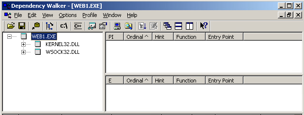
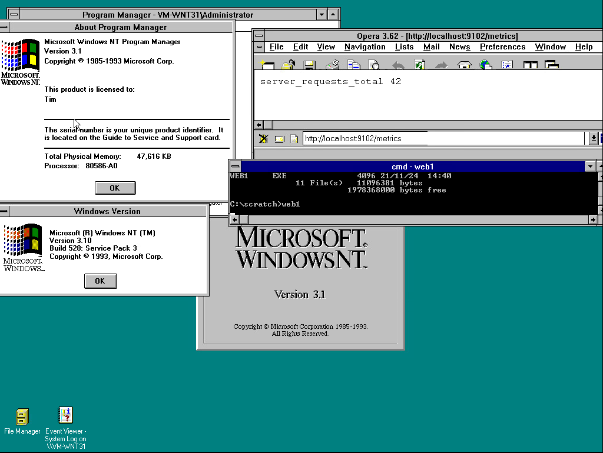
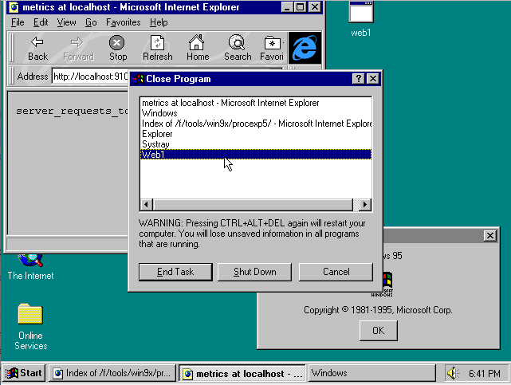

# Minimal Webserver that runs on NT 3.1
This is a minimal embedded web server that runs on Windows NT 3.1 and Winsock 1.  Limiting the APIs to this level allows the application to run on ANY NT or 9x-based version of Windows.  The binary only depends on wsock32.dll and kernel32.dll, it uses no C runtime library.  The server contains two arrays that make a virtual file system, `filenames` and `filedata`.



This approach allows the content of URLs to easily be altered by the program (the server was created as part of a prometheus exporter).

Or an entire static website could be compiled into the binary.

# Compiling
The Windows NT 3.1 executable format is somewhat different than that of NT 3.51 and later versions.  Microsoft Visual C++ 2.0 will automatically link in a way that works on NT 3.1.  Watcom 10 might as well.  More recent versions of Visual C++, up through at least Visual C++ 7.1 / Visual Studio .NET 2003 will make a functional executable if you do not link with the C runtime library and specify the subsystem.

To make an application that runs on the Win32s, add the /FIXED:NO parameter to link. This adds a .reloc section, which is required for Win32s but not for NT 3.1 or more modern systems.  The web server does not currently seem to work on the Win32s.

To compile for NT 3.1, on any Visual C++ version 2003 or earlier (possibly later), use the following command line:
```
cl web_ws1_a.c /link /nodefaultlib /FIXED:NO /subsystem:windows,3.10 /entry:_start kernel32.lib wsock32.lib
```

You can compile it with Tiny C Compiler, which will produce an executable that works back to NT 3.51 or early versions of Windows 95 without requiring a [Winsock 2 shim](https://github.com/DaniElectra/winsock351).
```
\local\tcc32\tcc.exe -impdef %SYSTEMROOT%\system32\wsock32.dll
\local\tcc32\tcc.exe web_ws1.c wsock32.def
```

# Running
The server is set to listen on :9102.  It will return a 404 status code unless you go to /metrics, where it will return a dummy Prometheus result.

You need to kill the process to kill it as it doesn't open a terminal or produce any UI.



